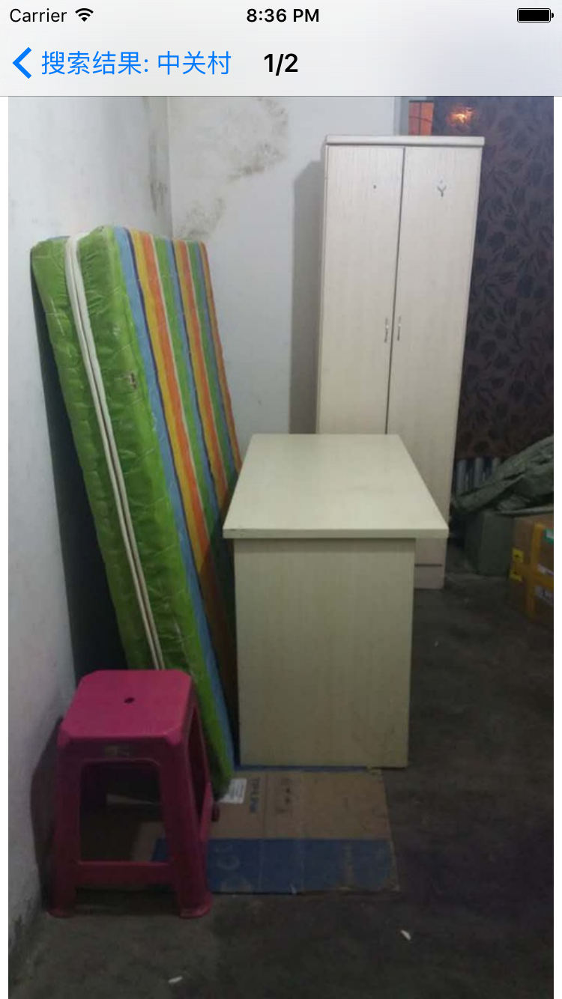

# Zhaoxinwo-iOS
找新窝iOS客户端，原网站zhaoxinwo.com

# 找新窝介绍
---

找新窝可以帮助你查找豆瓣上的北京租房信息([例](http://www.douban.com/group/26926))。

到现在，找新窝已经运行了超过一年，有一千多个用户使用了它。

[安卓源码](https://github.com/zhaoxinwo/zhaoxinwo-android) 和 [搜索引擎源码](https://github.com/zhengbuqian/zufang).

# iOS

[App Store](https://itunes.apple.com/cn/app/zhao-xin-wo/id1086589862?l=en&mt=8)

# 网站
---

[找新窝](http://zhaoxinwo.com)

# Android
---

[在小米应用商店中查看](http://app.mi.com/detail/83659)

# License
---

MIT

[@zhengbuqian](https://github.com/zhengbuqian)